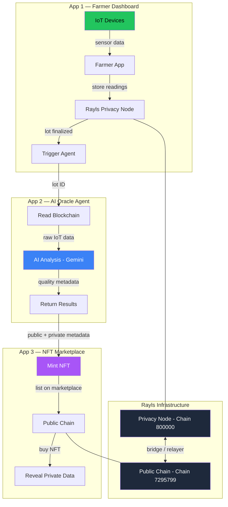
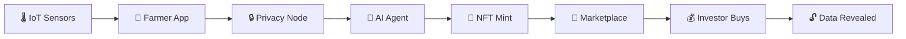
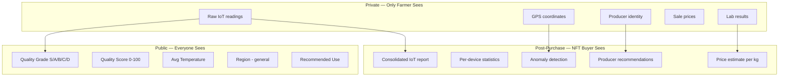
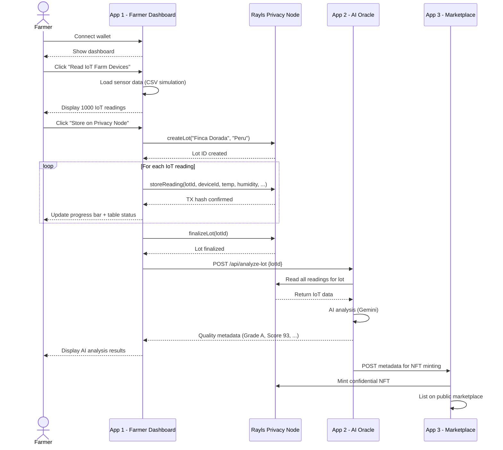
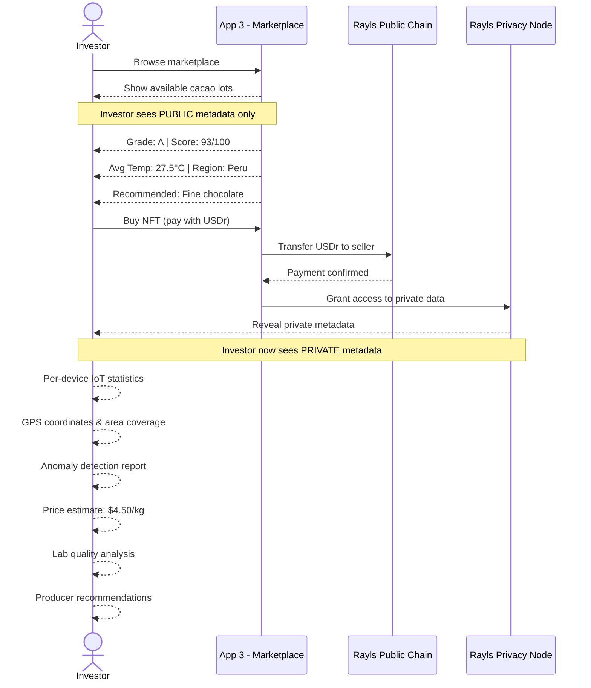
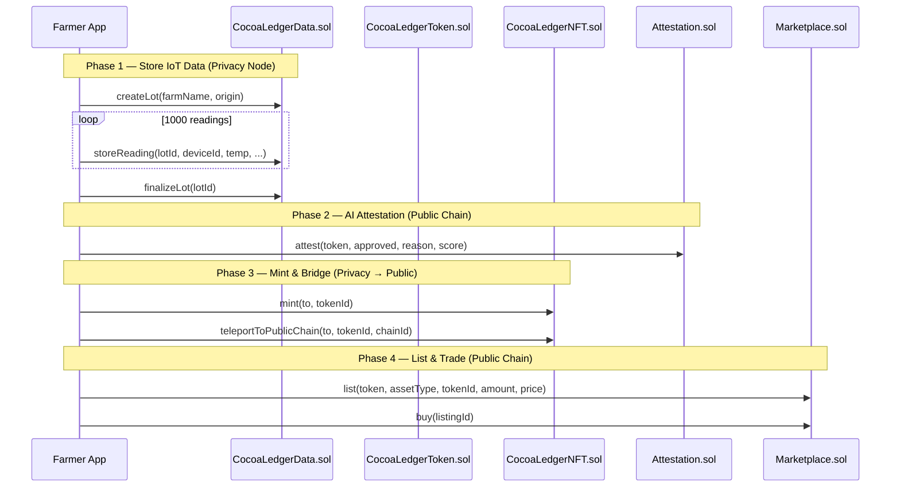

# 🌱 Cocoa Ledger

Bringing transparency and trust to the cacao supply chain through IoT, blockchain privacy, and AI-powered quality analysis.

## The Problem

Cacao farmers in Latin America face critical challenges:
- No traceability — buyers can't verify origin or quality
- Low income — intermediaries capture most of the value
- No technology — manual processes, no data history
- Quality issues — inconsistent fermentation, diseases, no monitoring

Meanwhile, global cacao scarcity is increasing due to climate change, aging crops, and farmer abandonment.

## The Solution

Cocoa Ledger transforms each cacao harvest lot into a verifiable digital asset:

1. **IoT sensors** monitor farm conditions (temperature, humidity, soil, rainfall)
2. **Private blockchain** stores all raw data — only the farmer can see it
3. **AI agent** analyzes the data and scores harvest quality
4. **Confidential NFT** packages the analysis — investors buy to unlock private data

## Architecture



## Data Flow



## Privacy Model



## Farmer Journey



## Investor Journey



## Smart Contract Interaction



## Project Structure

```
cocoa-ledger/
├── app/                    ← NextJS farmer dashboard
│   ├── src/app/            ← Landing page + dashboard
│   ├── src/components/     ← UI components
│   └── public/             ← IoT CSV data
├── agent/                  ← AI oracle service
│   ├── src/                ← Express API + Gemini analysis
│   ├── skills/             ← ETHSkills references
│   └── Dockerfile          ← Container deployment
└── contracts/              ← Foundry smart contracts
    ├── src/                ← CocoaLedger contracts
    └── script/             ← Deploy and interaction scripts
```

## Tech Stack

| Component | Technology |
|-----------|-----------|
| Frontend | Next.js 16, Tailwind, shadcn/ui, RainbowKit |
| Contracts | Solidity 0.8.24, Foundry, Rayls Protocol SDK |
| Agent | TypeScript, Express, Google Gemini |
| Privacy Chain | Rayls Privacy Node (gasless, EVM) |
| Public Chain | Rayls Public Chain (reth-based) |
| Deploy | Netlify (app), Hetzner VPS (agent) |

## Quick Start

```bash
# Contracts
cd contracts && forge install && npm install
forge script script/DeployCocoaLedger.s.sol --rpc-url $PRIVACY_NODE_RPC_URL --broadcast --legacy

# App
cd app && npm install
cp .env.local.example .env.local  # fill in values
npm run dev

# Agent
cd agent && npm install
cp .env.example .env  # fill in keys
npx tsx src/index.ts
```

## Built for EthCC 26 — Rayls Hackathon #2

Challenge: Autonomous Institution Agent + Confidential NFT Reveal
