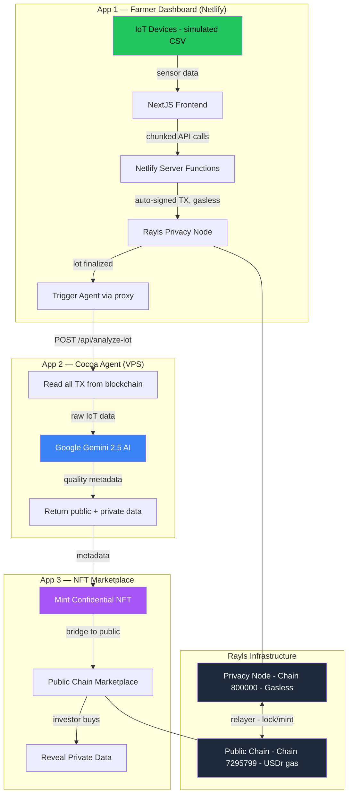
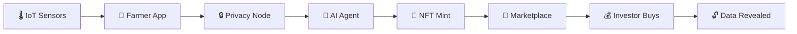
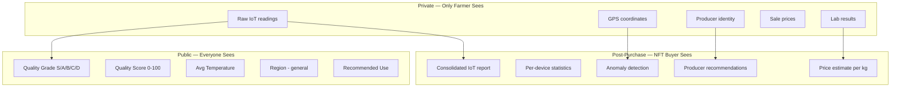
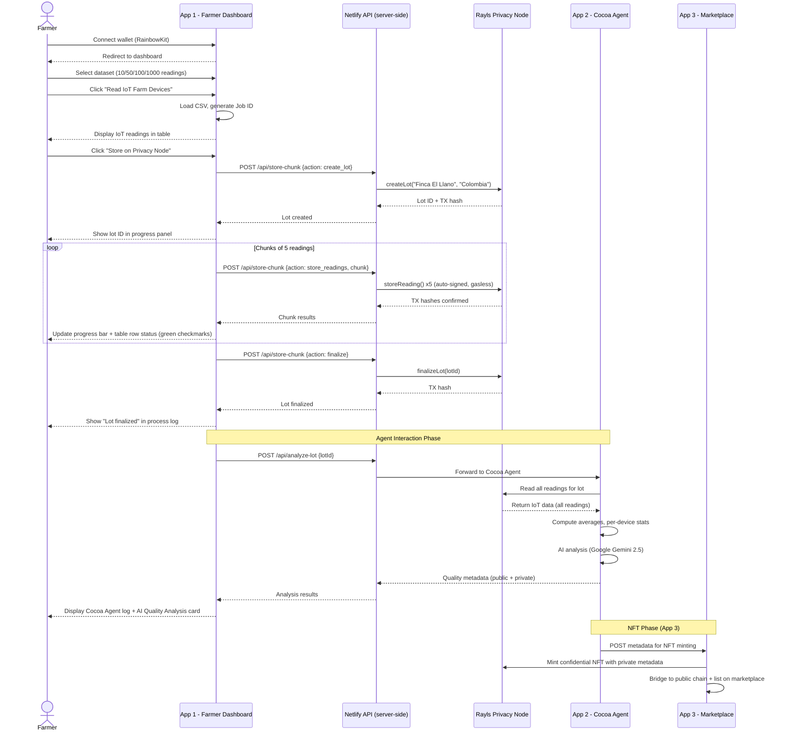
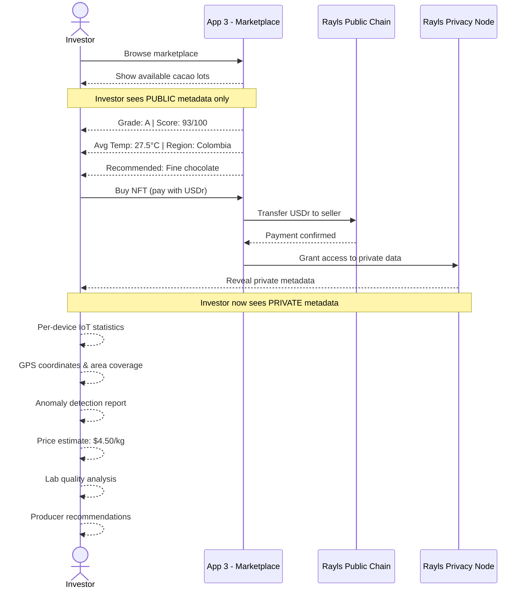
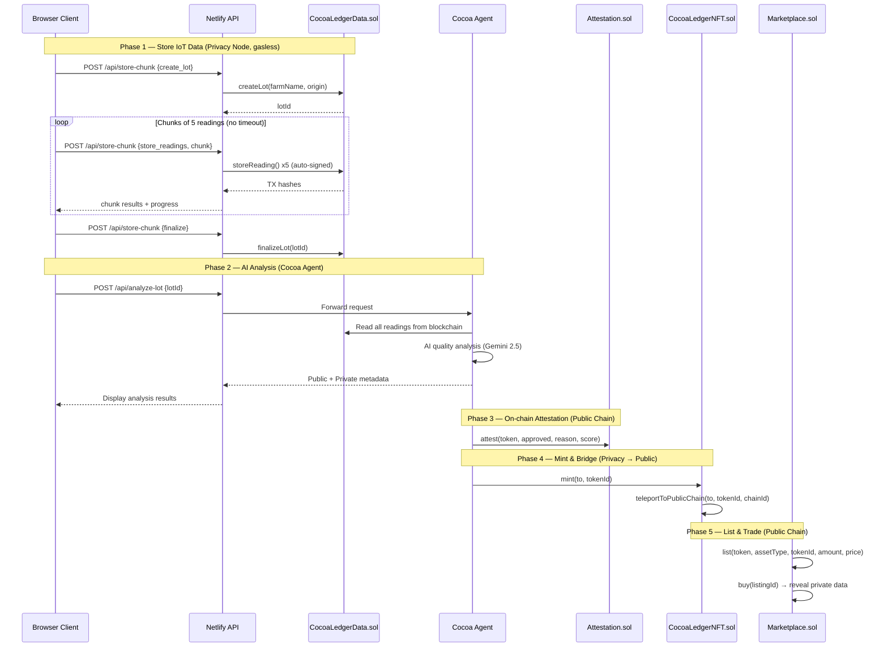

# 🌱 Cocoa Ledger

Bringing transparency and trust to the cacao supply chain through IoT, blockchain privacy, and AI-powered quality analysis.

## The Problem

Cacao farmers in Latin America face critical challenges:
- No traceability — buyers can't verify origin or quality
- Low income — intermediaries capture most of the value
- No technology — manual processes, no data history
- Quality issues — inconsistent fermentation, diseases, no monitoring

Meanwhile, global cacao scarcity is increasing due to climate change, aging crops, and farmer abandonment.

## The Solution

Cocoa Ledger transforms each cacao harvest lot into a verifiable digital asset:

1. **IoT sensors** monitor farm conditions (temperature, humidity, soil, rainfall)
2. **Private blockchain** stores all raw data — only the farmer can see it
3. **AI agent** analyzes the data and scores harvest quality
4. **Confidential NFT** packages the analysis — investors buy to unlock private data

## Why Blockchain Instead of a Database?

A traditional database could store IoT data. But it can't solve the **trust problem**:

| Problem | Database | Rayls Privacy Node |
|---------|----------|-------------------|
| Farmer claims "organic" | No way to verify | Every reading is an immutable transaction |
| Intermediary alters quality data | DB admin can edit records | Nobody can modify on-chain data |
| Buyer wants proof of conditions | Trust the seller's word | Verify against blockchain transactions |
| Auditor needs history | Export from DB (tamperable) | Full on-chain audit trail |
| Cross-border trade compliance | Each party has own DB | Shared verifiable ledger |

The Privacy Node specifically solves what a public blockchain cannot:
- **Raw IoT data is commercially sensitive** — a competitor could undercut the farmer's pricing if they see real conditions
- **GPS coordinates reveal farm locations** — security risk in regions with land disputes
- **Volume and pricing data** — gives unfair negotiation advantage if public
- **Regulatory compliance** — GDPR-like data protection requirements in some markets

The Rayls Privacy Node is **gasless** (zero transaction cost), making it viable to store thousands of IoT readings that would be prohibitively expensive on Ethereum mainnet.

## How Quality Scoring Works

The AI agent (Cocoa Agent) uses a multi-factor scoring system based on cacao agronomics:

### Grading Criteria

| Grade | Score | Meaning | Typical Use |
|-------|-------|---------|------------|
| **S** | 95-100 | Exceptional — perfect growing conditions across all metrics | Single-origin premium chocolate, auction lots |
| **A** | 85-94 | Excellent — consistently good conditions with minor variations | Fine chocolate, specialty couverture |
| **B** | 70-84 | Good — generally acceptable with some deviations | Quality blends, mid-range chocolate |
| **C** | 50-69 | Fair — notable issues in one or more metrics | Bulk processing, commodity market |
| **D** | 0-49 | Poor — significant problems detected | Requires intervention, not market-ready |

### Scoring Factors

Each factor is weighted based on its impact on cacao quality:

| Factor | Ideal Range | Impact on Score |
|--------|------------|----------------|
| **Temperature** | 20-30°C | High — affects bean development and flavor precursors |
| **Humidity** | 70-90% | High — too low = stress, too high = disease risk |
| **Soil pH** | 5.0-7.5 | Medium — affects nutrient absorption |
| **Rainfall** | 100-200mm/month | Medium — drought or flooding impacts yield |
| **Soil Moisture** | 40-80% | Medium — root health indicator |
| **Light Intensity** | 10K-40K lux | Low — cacao prefers partial shade |
| **Cross-device consistency** | Low variance | High — inconsistency suggests micro-problems |
| **Anomaly count** | Zero | High — spikes indicate equipment failure or events |

The AI analyzes all readings together, computing:
1. **Averages** per metric across all devices
2. **Per-device statistics** to detect inconsistencies
3. **Anomaly detection** — readings outside expected ranges
4. **Temporal patterns** — is quality improving or degrading over time?
5. **Regional benchmarks** — how do conditions compare to known premium cacao regions?

The final score is the AI's holistic assessment considering all factors. Two lots with identical temperature but different soil pH and humidity patterns will score differently.

## Why Buyers Use Blockchain for Harvest Purchases

This isn't just buying chocolate — it's **commodity trading with verifiable quality data**.

### The Buyer's Problem Today

A cacao buyer (chocolate manufacturer, commodity trader, specialty roaster) currently:
1. Receives a sample from a broker
2. Sends it to a lab ($200-500, takes 1-2 weeks)
3. Negotiates price based on the lab report
4. Has no visibility into growing conditions
5. Discovers quality issues only after receiving the full shipment

### What Cocoa Ledger Changes

```
Traditional: Sample → Lab → Negotiate → Ship → Hope for the best
Cocoa Ledger: Browse marketplace → See AI-verified growing data → Buy with confidence
```

**Before purchase (public metadata):**
- Quality grade and score based on real IoT data
- Growing conditions summary (not just a lab test of one sample)
- AI assessment of crop health and recommended use
- On-chain verification that data hasn't been tampered with

**After purchase (private metadata unlocked):**
- Exact farm location for supply chain planning
- Per-device sensor data for due diligence
- Price benchmark per kg based on quality
- Producer recommendations (feedback loop to farmer)
- Full IoT data hash for independent verification

### Why This Works on Blockchain

1. **Trust without intermediaries** — The buyer trusts the data because it's on-chain and AI-verified, not because a broker says it's good
2. **Instant settlement** — Buy the NFT, receive the data. No weeks of negotiation
3. **Provenance is permanent** — The entire history of that lot (from seed to sale) is immutable
4. **Secondary market** — Buyers can resell harvest rights to other manufacturers
5. **DeFi integration** — Harvest NFTs can be used as collateral for trade financing

### The NFT Represents a Real Asset

The NFT is not speculative art — it's a **digital deed to a cacao harvest lot** with:
- Verifiable growing conditions (thousands of IoT readings)
- AI quality certification
- Private data access rights
- Transferable ownership

When a chocolate manufacturer buys this NFT, they're buying **verified, data-backed access to a specific harvest** — something that doesn't exist in today's cacao market.

## Architecture



## Data Flow



## Privacy Model



## Farmer Journey



## Investor Journey



## Smart Contract Interaction



## Technical Details

### Chunked Transaction Processing
The app stores IoT readings in **chunks of 5** to avoid serverless function timeouts:
- Each chunk is a separate API call (~5-8 seconds)
- Server-side auto-signing (no MetaMask popups for 1000 transactions)
- Privacy Node is gasless — zero transaction fees
- Progress updates after each chunk completes
- Cancel support between chunks

### Three Log Sections
1. **Process Log** — Every blockchain transaction with clickable Blockscout links
2. **Cocoa Agent Interaction** — AI agent connection, analysis steps, scoring details
3. **AI Quality Analysis Card** — Grade, score, price estimate, recommendations

### Browser Console Logs
Detailed colored console output for judges — every step is logged with emojis and clickable explorer links.

## Project Structure

```
cocoa-ledger/
├── app/                         ← NextJS farmer dashboard (Netlify)
│   ├── src/app/page.tsx         ← Landing page (hero, CTA)
│   ├── src/app/dashboard/       ← Authenticated dashboard
│   ├── src/app/api/             ← Server API routes
│   │   ├── store-chunk/         ← Chunked blockchain storage
│   │   ├── store-stream/        ← SSE streaming (fallback)
│   │   └── analyze-lot/         ← Agent proxy (HTTPS → HTTP)
│   ├── src/components/          ← UI: table, storage panel, logs
│   ├── src/lib/                 ← Chain config, contract ABI, types
│   └── public/                  ← IoT CSV datasets (10/50/100/1000)
├── agent/                       ← Cocoa Agent — AI oracle (VPS)
│   ├── src/index.ts             ← Express server
│   ├── src/blockchain.ts        ← Read from Privacy Node
│   ├── src/analyzer.ts          ← Gemini AI analysis
│   ├── src/types.ts             ← TypeScript types
│   ├── skills/                  ← ETHSkills (standards, security)
│   ├── Dockerfile               ← Container deployment
│   └── README.md                ← OpenClaw agent setup guide
├── contracts/                   ← Foundry smart contracts
│   ├── src/CocoaLedgerData.sol  ← IoT storage (lots, readings)
│   ├── src/CocoaLedgerToken.sol ← Bridgeable ERC20
│   ├── src/CocoaLedgerNFT.sol   ← Bridgeable ERC721
│   ├── src/Attestation.sol      ← AI attestation registry
│   ├── src/Marketplace.sol      ← Escrow marketplace
│   └── script/                  ← Deploy scripts
└── docs/                        ← Deployment and technical guides
```

## Tech Stack

| Component | Technology |
|-----------|-----------|
| Frontend | Next.js 16, Tailwind, shadcn/ui, RainbowKit |
| Contracts | Solidity 0.8.24, Foundry, Rayls Protocol SDK |
| Agent | TypeScript, Express, Google Gemini |
| Privacy Chain | Rayls Privacy Node (gasless, EVM) |
| Public Chain | Rayls Public Chain (reth-based) |
| Deploy | Netlify (app), Hetzner VPS (agent) |

## Quick Start

```bash
# Contracts
cd contracts && forge install && npm install
forge script script/DeployCocoaLedger.s.sol --rpc-url $PRIVACY_NODE_RPC_URL --broadcast --legacy

# App
cd app && npm install
cp .env.local.example .env.local  # fill in values
npm run dev

# Agent
cd agent && npm install
cp .env.example .env  # fill in keys
npx tsx src/index.ts
```

## Built for EthCC 26 — Rayls Hackathon #2

Challenge: Autonomous Institution Agent + Confidential NFT Reveal
