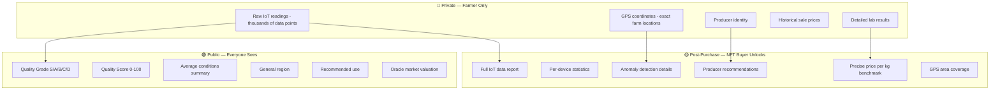
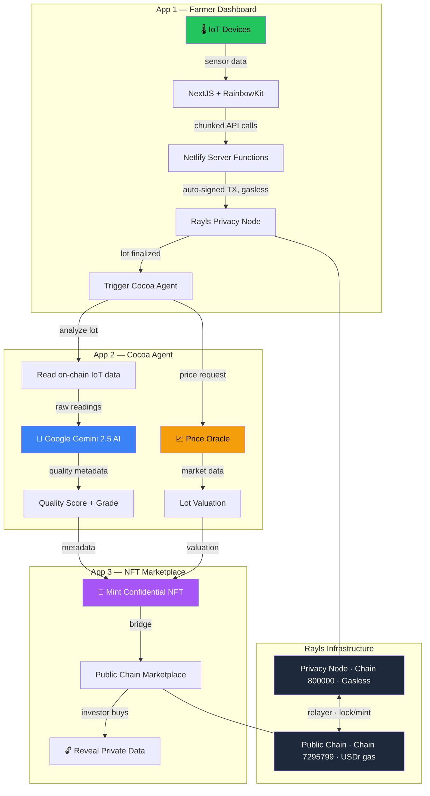
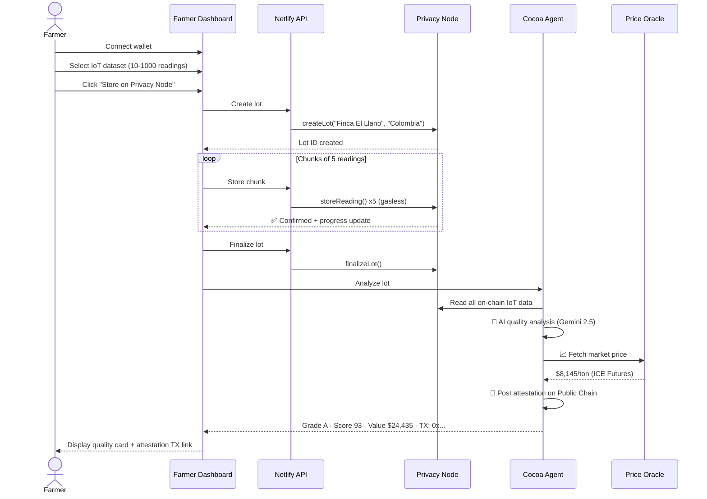
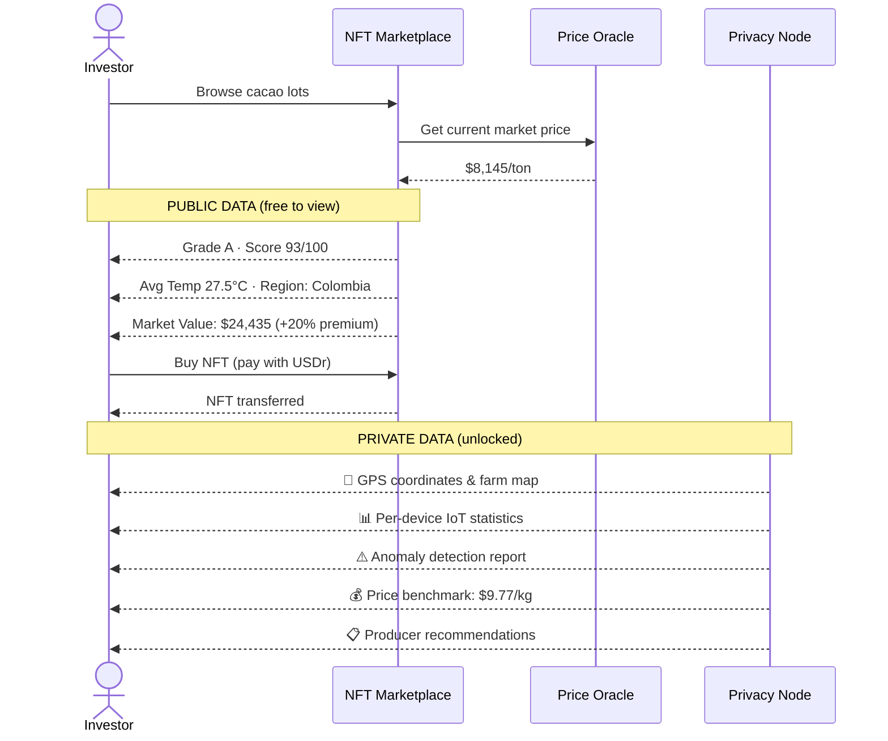
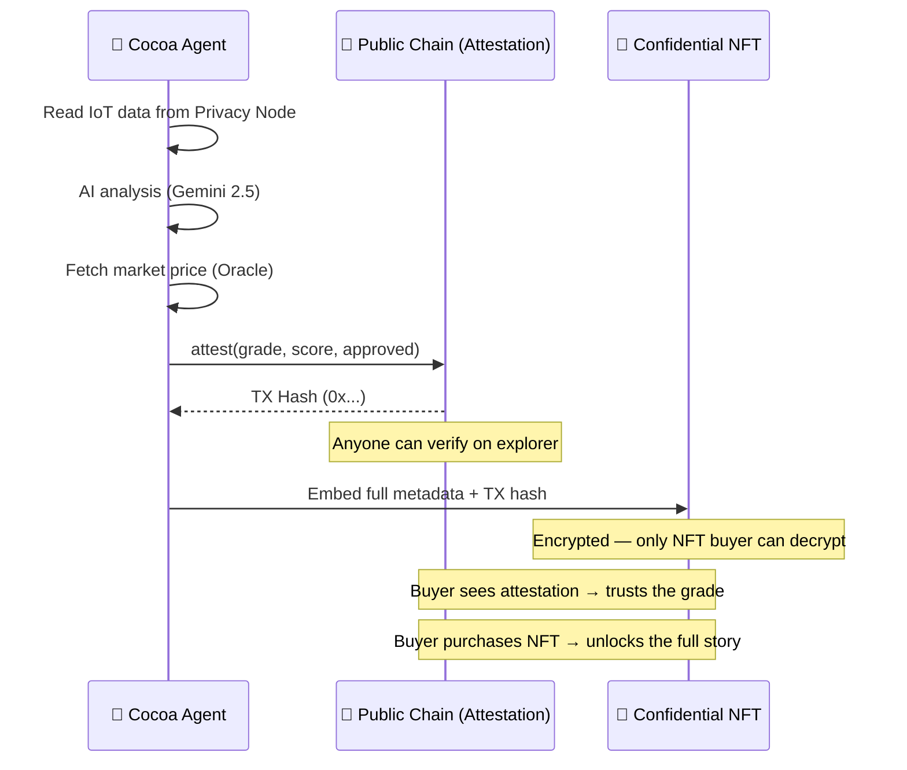
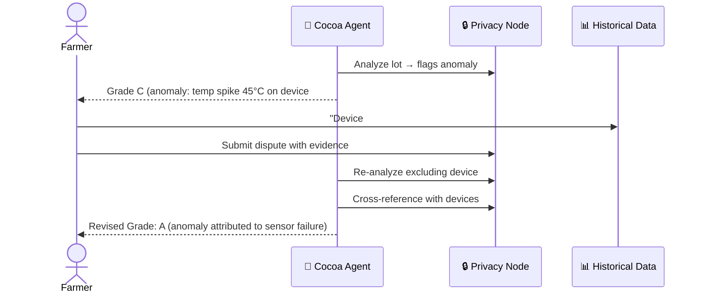

# 🌱 Cocoa Ledger

**From farm to blockchain — verifiable cacao quality, powered by AI and privacy.**

> Every cacao harvest tells a story. Cocoa Ledger puts that story on-chain — private where it matters, transparent where it counts.

---

## 🏆 Built for EthCC 26 — Rayls Hackathon #2

**Challenge:** Autonomous Institution Agent + Confidential NFT Reveal

**Live Demo:** [cocoa-ledger-app.netlify.app](https://cocoa-ledger-app.netlify.app)

---

## 💡 The Problem

The global cacao market is broken:

- **$130B chocolate industry** — yet farmers earn less than $2/day
- **Zero traceability** — buyers can't verify origin, quality, or growing conditions
- **Blind trust** — intermediaries control information, manipulate pricing
- **No data** — manual processes, no monitoring, no history
- **Growing scarcity** — climate change, aging crops, farmer abandonment

A buyer today receives a sample, pays $200-500 for lab testing, waits 1-2 weeks, negotiates price on the seller's word, and hopes the full shipment matches the sample. There's no verifiable link between growing conditions and final quality.

## ✅ The Solution

Cocoa Ledger transforms each cacao harvest into a **verifiable, tradeable digital asset** by combining four technologies:

| Layer | What | Why |
|-------|------|-----|
| 🌡️ **IoT Sensors** | Monitor temperature, humidity, soil pH, rainfall, light | Real data from the field — not self-reported claims |
| 🔒 **Rayls Privacy Node** | Store all raw readings on a gasless private blockchain | Immutable, tamper-proof, commercially sensitive data stays private |
| 🤖 **AI Oracle Agent** | Analyze IoT data + fetch live commodity prices | Autonomous quality scoring + market-anchored valuations |
| 🎨 **Confidential NFT** | Package the analysis into a tradeable asset | Buyers purchase access to verified private data |

### The Flow

```
🌡️ IoT Sensors → 🔒 Privacy Chain → 🤖 AI Analysis + Price Oracle → 🎨 NFT Mint → 🏪 Marketplace → 💰 Purchase → 🔓 Data Revealed
```

**Before purchase:** Buyer sees quality grade, score, growing conditions summary.
**After purchase:** Buyer unlocks GPS locations, per-device stats, anomaly reports, price benchmarks, producer recommendations.

---

## 🤖 Cocoa Agent — The Autonomous AI Oracle

The Cocoa Agent is the brain of the system — an autonomous AI that performs two critical functions:

### 1. Quality Analysis Oracle

Reads all on-chain IoT data for a cacao lot and produces a comprehensive quality assessment using Google Gemini 2.5:

- **Multi-factor scoring** — Temperature stability, humidity, soil pH, rainfall, soil moisture, light intensity
- **Per-device analysis** — Cross-device consistency detection
- **Anomaly detection** — Identifies equipment failures, environmental events, data irregularities
- **Holistic grading** — S/A/B/C/D system based on cacao agronomics

### 2. Price Oracle

Fetches **live cacao commodity prices** from global markets and uses them to produce real-world valuations:

```
Market Price ($8,145/ton) × Lot Volume (2,500 kg) × Quality Premium (1.2x) = $24,435
```

**Data Sources:**
| Priority | Source | Type |
|----------|--------|------|
| 1st | Trading Economics | Real-time ICE Futures |
| 2nd | World Bank Commodity API | Monthly reference prices |
| 3rd | Verified fallback | Last known market price |

Prices are cached (5 min TTL), transparent (every response shows sources checked), and include 15 months of historical data for trend analysis.

### Agent API

| Endpoint | Method | Description |
|----------|--------|-------------|
| `/api/health` | GET | Health check |
| `/api/analyze-lot` | POST | AI quality analysis + on-chain attestation |
| `/api/attestations/:token` | GET | Read attestations for a token address |
| `/api/oracle/price` | GET | Current cacao market price (ICE Futures US) |
| `/api/oracle/history` | GET | 15 months historical price data |
| `/api/oracle/valuation` | POST | Lot market valuation (price × volume × quality) |

---

## 📊 Quality Scoring System

### Grading Criteria

| Grade | Score | Meaning | Market Use | Price Premium |
|-------|-------|---------|------------|---------------|
| 🏆 **S** | 95-100 | Exceptional — perfect conditions | Single-origin premium, auction lots | **+35%** |
| 🥇 **A** | 85-94 | Excellent — consistently good | Fine chocolate, specialty couverture | **+20%** |
| 🥈 **B** | 70-84 | Good — acceptable with deviations | Quality blends, mid-range | **+5%** |
| 🥉 **C** | 50-69 | Fair — notable issues | Bulk processing, commodity | **-10%** |
| ⚠️ **D** | 0-49 | Poor — significant problems | Requires intervention | **-30%** |

### Scoring Factors

| Factor | Ideal Range | Weight | Why It Matters |
|--------|------------|--------|----------------|
| Temperature | 20-30°C | High | Bean development, flavor precursors |
| Humidity | 70-90% | High | Stress (low) vs disease risk (high) |
| Soil pH | 5.0-7.5 | Medium | Nutrient absorption |
| Rainfall | 100-200mm/mo | Medium | Drought or flooding impact |
| Soil Moisture | 40-80% | Medium | Root health |
| Light Intensity | 10K-40K lux | Low | Cacao prefers partial shade |
| Cross-device consistency | Low variance | High | Micro-problems detection |
| Anomaly count | Zero | High | Equipment failure, events |

### Valuation Example

A 2,500 kg lot at current market rates:

| Grade | Base Value | Multiplier | Final Value |
|-------|-----------|------------|-------------|
| **S** (Score 97) | $20,363 | 1.35x | **$27,489** |
| **A** (Score 91) | $20,363 | 1.20x | **$24,435** |
| **B** (Score 75) | $20,363 | 1.05x | **$21,381** |
| **C** (Score 55) | $20,363 | 0.90x | **$18,326** |
| **D** (Score 30) | $20,363 | 0.70x | **$14,254** |

---

## 🔒 Privacy Architecture

### Why Privacy Matters

Raw IoT data is commercially sensitive. Making it public would:
- Let competitors undercut farmer pricing
- Expose farm GPS locations (security risk in regions with land disputes)
- Give unfair negotiation advantage to buyers
- Violate data protection regulations

### Three-Tier Data Model



### Why Blockchain Instead of a Database?

| Challenge | Traditional Database | Rayls Privacy Node |
|-----------|---------------------|-------------------|
| "Is this organic?" | No way to verify | Every reading is an immutable transaction |
| Data tampering | Admin can edit records | Nobody can modify on-chain data |
| Proof of conditions | Trust the seller | Verify against blockchain transactions |
| Audit trail | Exportable, tamperable | Immutable on-chain history |
| Cross-border compliance | Fragmented databases | Shared verifiable ledger |
| Cost | Server infrastructure | **Gasless** — zero transaction fees |

---

## 🏗️ Architecture



---

## 🚜 Farmer Journey



## 💰 Investor Journey



---

## ⚡ Technical Highlights

### Chunked Transaction Processing
- IoT readings stored in **chunks of 5** — no serverless timeouts
- **Server-side auto-signing** — no MetaMask popups for 1000 transactions
- **Privacy Node is gasless** — zero fees, even for thousands of readings
- Real-time progress updates with cancellation support

### Three Log Sections (Judge-Friendly)
1. **Process Log** — Every blockchain TX with clickable Blockscout links
2. **Cocoa Agent Interaction** — AI connection, analysis steps, scoring
3. **AI Quality Analysis Card** — Grade, score, price estimate, recommendations

### On-Chain Attestation vs. Confidential NFT — What Goes Where and Why

This is the core **Disclosure Design** of Cocoa Ledger. Not all data should be public, and not all data should be hidden. The split follows real institutional logic:

```
AI Analysis → Attestation (public proof) + Confidential NFT (private value)
```

#### Side-by-Side Comparison

| Data Point | 📝 Attestation (Public Chain) | 🔐 Confidential NFT (Encrypted) |
|------------|------------------------------|----------------------------------|
| **Quality Grade** | ✅ S/A/B/C/D | ✅ Included |
| **Quality Score** | ✅ 0-100 | ✅ Included |
| **Approved / Rejected** | ✅ Boolean | ✅ Included |
| **Agent Address** | ✅ Who attested | ✅ Included |
| **Farm Name & Origin** | ✅ General info | ✅ Included |
| **Lot ID & Readings Count** | ✅ Reference numbers | ✅ Included |
| **Timestamp** | ✅ When attested | ✅ Included |
| **Attestation TX Hash** | ✅ On-chain proof | ✅ Embedded for verification |
| **Per-Device IoT Statistics** | ❌ | ✅ Detailed sensor breakdowns |
| **GPS Coordinates** | ❌ | ✅ Exact farm locations |
| **Anomaly Detection Report** | ❌ | ✅ Equipment failures, events |
| **Price Estimate per kg** | ❌ | ✅ Oracle-backed market valuation |
| **Full AI Analysis Report** | ❌ | ✅ Detailed agronomic assessment |
| **Lab Quality Analysis** | ❌ | ✅ Comprehensive quality report |
| **Producer Recommendations** | ❌ | ✅ Actionable feedback |
| **IoT Data Hash** | ❌ | ✅ Verify raw data integrity |
| **Historical Price Context** | ❌ | ✅ Market trend data |

#### Why This Split?

**The attestation is like a credit score** — it tells you the result (Grade A, Score 93) but not the underlying data. Anyone can see it, verify it on the explorer, and use it to make a quick decision.

**The NFT is like the full credit report** — it contains the detailed evidence behind the score. GPS locations, per-device sensor data, anomaly reports, price benchmarks, and the complete AI analysis. This is the real value.

**Attestation (Public)** answers: *"Is this lot good?"*
**NFT (Private)** answers: *"Why is it good, and what exactly are the conditions?"*

#### Why Not Put Everything Public?

| Private Data | Risk if Public |
|-------------|---------------|
| GPS coordinates | Competitors locate farms, land disputes, security risk |
| Per-device statistics | Reveals farm infrastructure and monitoring capabilities |
| Price per kg estimate | Undermines farmer's negotiation position |
| Anomaly reports | Could be used to depress lot price unfairly |
| Producer recommendations | Private operational feedback |
| IoT data hash | Combined with public data could reverse-engineer locations |

#### The Flow



#### Real-World Analogy

Think of buying a house:
- **Public record (attestation):** Address, sale price, property type, inspection pass/fail — anyone can look this up
- **Private report (NFT):** Full inspection report, structural analysis, environmental tests, repair recommendations — you pay for this

Cocoa Ledger does the same for cacao. The attestation builds trust. The NFT delivers value.

---

## 🛡️ IoT Dispute System — Solving False Positives

IoT sensors fail. Batteries die, humidity corrodes circuits, insects block readings, solar panels get dirty. In traditional systems, a single bad reading can tank an entire lot's score — and the farmer has no recourse.

### The Problem

| Failure Type | What Happens | Impact Without Dispute |
|-------------|-------------|----------------------|
| Sensor malfunction | Temperature spike to 45°C (false) | Lot downgraded from A to C |
| Battery dying | Readings stop mid-harvest | "Insufficient data" = no certification |
| Calibration drift | Soil pH reads 3.0 instead of 6.0 | AI flags as "acidic soil anomaly" |
| Network outage | 12 hours of missing data | Gap interpreted as equipment failure |
| Physical damage | Humidity sensor reads 0% | "Extreme drought" anomaly flagged |

A false positive from a faulty sensor can **cost the farmer thousands of dollars** in lost premium pricing.

### How Cocoa Ledger Solves This

Because all IoT data is stored **immutably on the Rayls Privacy Node**, the farmer has a complete, tamper-proof historical record. This enables a dispute system:



### Why This Only Works on Blockchain

| Requirement | Database | Rayls Privacy Node |
|-------------|---------|-------------------|
| Prove readings weren't altered | ❌ Admin could edit | ✅ Immutable on-chain |
| Show device history over time | ❌ Logs can be deleted | ✅ Every reading is a transaction |
| Compare across multiple harvests | ❌ Data fragmented | ✅ All lots on same chain |
| Third-party audit of dispute | ❌ Trust the farmer | ✅ Auditor reads blockchain directly |
| Timestamp proof | ❌ System clock can be changed | ✅ Block timestamp is consensus |

### What the AI Agent Does During Disputes

1. **Cross-device validation** — If 4 out of 5 sensors show normal temperature and 1 shows 45°C, the agent identifies the outlier
2. **Historical comparison** — Compares current lot readings against the farm's historical patterns from previous harvests stored on-chain
3. **Temporal analysis** — Identifies if the anomaly is a sudden spike (likely failure) vs gradual change (likely real)
4. **Confidence scoring** — Adjusts the quality score confidence based on data reliability
5. **Transparent reasoning** — The dispute resolution and reasoning are included in the attestation

### For the Farmer

The dispute system means:
- **No false penalties** — A broken sensor doesn't destroy your harvest's value
- **Provable history** — Your clean track record is on-chain, not in someone's spreadsheet
- **Fair re-evaluation** — The AI re-analyzes with the dispute context, not just raw numbers
- **Audit trail** — Every dispute, resolution, and re-attestation is recorded immutably

This is **data sovereignty** in practice. The farmer's IoT history on the Privacy Node isn't just data storage — it's their **reputation ledger** that protects them from the imperfections of hardware.

---

### Smart Contract Suite

| Contract | Chain | Address | Purpose |
|----------|-------|---------|---------|
| `CocoaLedgerData.sol` | Privacy (800000) | `0x47B1...b4c6fC` | IoT data storage (lots + readings) |
| `Attestation.sol` | Public (7295799) | `0x7f75...C0810` | AI quality attestation registry |
| `CocoaLedgerToken.sol` | Privacy → Public | — | Bridgeable ERC-20 |
| `CocoaLedgerNFT.sol` | Privacy → Public | — | Bridgeable ERC-721 (harvest NFTs) |
| `Marketplace.sol` | Public | — | Escrow marketplace for NFT trading |

---

## 📁 Project Structure

```
cocoa-ledger/
├── app/                             ← Farmer Dashboard (Netlify)
│   ├── src/app/page.tsx             ← Landing page
│   ├── src/app/dashboard/           ← Authenticated dashboard
│   ├── src/app/api/
│   │   ├── store-chunk/             ← Chunked blockchain storage
│   │   ├── analyze-lot/             ← Agent proxy
│   │   └── oracle/                  ← Price oracle proxy (price, history, valuation)
│   ├── src/components/              ← UI components
│   ├── src/lib/                     ← Chain config, ABI, types
│   └── public/                      ← IoT CSV datasets (10/50/100/1000)
│
├── agent/                           ← Cocoa Agent — AI Oracle (VPS)
│   ├── src/index.ts                 ← Express server (6 endpoints)
│   ├── src/blockchain.ts            ← Read from Privacy Node
│   ├── src/analyzer.ts              ← Gemini AI quality analysis
│   ├── src/price-oracle.ts          ← Multi-source cacao price oracle
│   ├── src/types.ts                 ← TypeScript types
│   ├── skills/                      ← Agent skills (standards, security, oracle)
│   └── Dockerfile                   ← Container deployment
│
├── contracts/                       ← Solidity Smart Contracts (Foundry)
│   ├── src/CocoaLedgerData.sol      ← IoT storage
│   ├── src/CocoaLedgerToken.sol     ← Bridgeable ERC-20
│   ├── src/CocoaLedgerNFT.sol       ← Bridgeable ERC-721
│   ├── src/Attestation.sol          ← AI attestation registry
│   ├── src/Marketplace.sol          ← Escrow marketplace
│   └── script/                      ← Deploy & interaction scripts
│
└── docs/                            ← Deployment guides
```

## 🛠️ Tech Stack

| Component | Technology | Why |
|-----------|-----------|-----|
| Frontend | Next.js 16, Tailwind, shadcn/ui, RainbowKit | Modern, fast, wallet-native |
| Contracts | Solidity 0.8.24, Foundry, Rayls SDK | Battle-tested, privacy-first |
| AI Agent | TypeScript, Express, Google Gemini 2.5 | Real-time quality analysis |
| Price Oracle | Multi-source (Trading Economics, World Bank) | Market-anchored valuations |
| Privacy Chain | Rayls Privacy Node (gasless, EVM) | Zero-cost data storage |
| Public Chain | Rayls Public Chain (reth-based) | NFT trading & attestations |
| Deploy | Netlify (app) + Hetzner VPS (agent) | Serverless + dedicated |

## 🚀 Quick Start

```bash
# Smart Contracts
cd contracts && forge install && npm install
forge script script/DeployCocoaLedger.s.sol --rpc-url $PRIVACY_NODE_RPC_URL --broadcast --legacy

# Farmer Dashboard
cd app && npm install
cp .env.local.example .env.local  # fill in values
npm run dev

# Cocoa Agent (AI Oracle + Price Oracle)
cd agent && npm install
cp .env.example .env  # fill in keys
npx tsx src/index.ts
```

---

## 🌍 Why This Matters

Cocoa Ledger isn't just a hackathon project — it's a blueprint for **how commodity markets should work**:

1. **Farmers get paid fairly** — Quality data proves their beans are premium, commanding higher prices
2. **Buyers trade with confidence** — Verifiable growing conditions, not broker promises
3. **AI removes gatekeepers** — Autonomous quality scoring eliminates expensive, slow lab testing
4. **Privacy protects the vulnerable** — Farmer data stays private until they choose to sell access
5. **Market prices anchor reality** — Oracle-powered valuations prevent manipulation

The cacao market is worth $130 billion. Every dollar of that moves on trust. Cocoa Ledger replaces trust with **proof**.

---

**Built with 🍫 for EthCC 26 — Rayls Hackathon #2**
